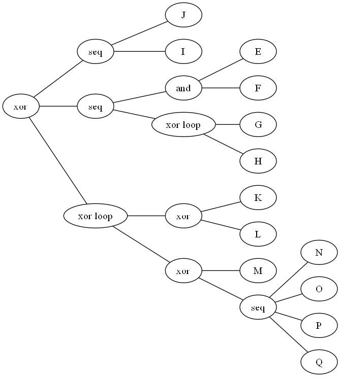
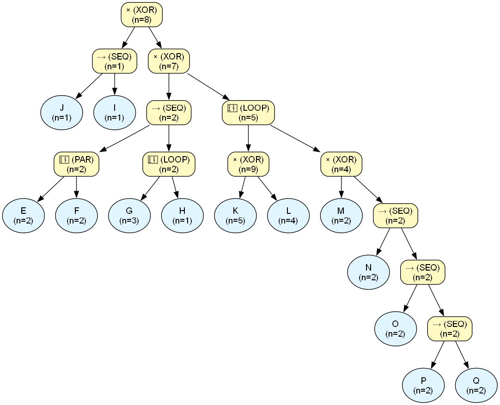
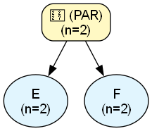
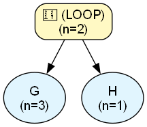
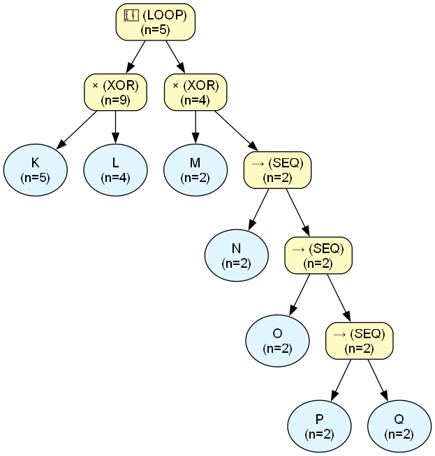
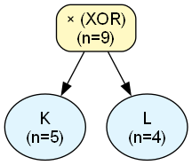

# Process Engine Audit Report

## Dataset & Audit Overview
| Metric | Value |
| :--- | :--- |
| **Dataset Name** | `test_11_nesting.csv` |
| **Noise Threshold** | `0.0` |
| **Fitness** | `N/A (skipped)` |
| **Precision** | `N/A (skipped)` |
| **Total Cases in Log** | `8` |
| **Unique Activities** | `13` |
| **XOR Operators** | `4` |
| **LOOP Operators** | `2` |
| **SEQ Operators** | `5` |
| **PAR Operators** | `1` |
| **Binarization Additions** | `3` |
| **Tau Operators Added** | `0` |
| **Total Found Patterns** | `39` |
| **Verified Patterns** | `27` |
| **Discrepancy Patterns** | `0` |
| **Ghost Patterns** | `0` |
| **Nested LOOPs** | `2` |
| **Nested PARs** | `1` |
| **Tree Exposure (Strict, End-to-End % of N)** | `12.50%` |
| **Tree Exposure (Strict, Fragment-Level % of N)** | `19.40%` |
| **Tree Exposure (Strict, Fragment-Level, >=2 activities, % of N)** | `12.50%` |
| **Tree Exposure (Local-Strict % of N)** | `100.00%` |
| **Tree Exposure (Local-Strict, >=2 activities, % of N)** | `100.00%` |
| **Total Forced Volume (incl. unresolved AS, % of N)** | `62.50%` |
| **AS-Resolved Volume (% of N)** | `37.50%` |
| **AS-Resolved Volume, PAR-only (% of N)** | `12.50%` |
| **AS-Resolved Volume, LOOP-only (% of N)** | `12.50%` |
| **AS-Opaque Volume (% of N)** | `12.50%` |
| **Data Exposure (Confirmed % of Claimed Volume)** | `100.00%` |
| **Data Exposure, ST-only (% confirmed)** | `100.00%` |
| **Data Exposure, ST + ST-in-PAR (% confirmed)** | `100.00%` |
| **Data Coverage, ST-only (% of real log)** | `10.34%` |
| **Data Coverage, ST + ST-in-PAR (% of real log)** | `24.14%` |
| **Data Coverage, Total (% of real log)** | `100.00%` |
| **Max Fractional Exposure (Worst-Case Normalized)** | `66.50%` |
| **Avg Fractional Exposure (Typical-Case Normalized)** | `79.74%` |
| **Mean Absolute Exposure Volume (events/case)** | `2.35` |

---

## Original PM4Py Tree




```text
X( ->( 'J', 'I' ), ->( +( 'E', 'F' ), *( 'G', 'H' ) ), *( X( 'K', 'L' ), X( 'M', ->( 'N', 'O', 'P', 'Q' ) ) ) )
```

## Assimilated Master Tree




## Trace Verification

| Type | Abstract Pattern | Variations Observed | Predicted Freq | Actual Log Freq | Audit Status |
| :--- | :--- | :--- | :--- | :--- | :--- |
| `[ST]` | `J` | Exact Token Match | $\ge$ 1 | **1** | ✅ **VERIFIED** |
| `[ST]` | `I` | Exact Token Match | $\ge$ 1 | **1** | ✅ **VERIFIED** |
| `[ST]` | `⟨J, I⟩` | Exact Token Match | $\ge$ 1 | **1** | ✅ **VERIFIED** |
| `[ST (in PAR_1)]` | `E` | Exact Token Match | $\ge$ 2 | **2** | ✅ **VERIFIED** |
| `[ST (in PAR_1)]` | `F` | Exact Token Match | $\ge$ 2 | **2** | ✅ **VERIFIED** |
| `[AS]` | `[nested PAR_1]` | Exact Token Match | $\ge$ 2 | **2** | ✅ **VERIFIED** |
| `[ST (in LOOP_2)]` | `G` | Exact Token Match | $\ge$ 3 | **3** | ✅ **VERIFIED** |
| `[ST (in LOOP_2)]` | `H` | Exact Token Match | $\ge$ 1 | **1** | ✅ **VERIFIED** |
| `[ST]` | `⟨G⟩` | Exact Token Match | $\ge$ 1 | **1** | ✅ **VERIFIED** |
| `[AS]` | `[nested LOOP_2]` | Exact Token Match | $\ge$ 1 | **2** | ✅ **VERIFIED** |
| `[ST]` | `⟨[nested PAR_1], G⟩` | Exact Token Match | $\ge$ 1 | **1** | ✅ **VERIFIED** |
| `[ST]` | `⟨[nested PAR_1], [nested LOOP_2]⟩` | Exact Token Match | $\ge$ 1 | **2** | ✅ **VERIFIED** |
| `[ST (in LOOP_3)]` | `K` | Exact Token Match | $\ge$ 5 | **5** | ✅ **VERIFIED** |
| `[ST (in LOOP_3)]` | `L` | Exact Token Match | $\ge$ 4 | **4** | ✅ **VERIFIED** |
| `[ST (in LOOP_3)]` | `M` | Exact Token Match | $\ge$ 2 | **2** | ✅ **VERIFIED** |
| `[ST (in LOOP_3)]` | `N` | Exact Token Match | $\ge$ 2 | **2** | ✅ **VERIFIED** |
| `[ST (in LOOP_3)]` | `O` | Exact Token Match | $\ge$ 2 | **2** | ✅ **VERIFIED** |
| `[ST (in LOOP_3)]` | `P` | Exact Token Match | $\ge$ 2 | **2** | ✅ **VERIFIED** |
| `[ST (in LOOP_3)]` | `Q` | Exact Token Match | $\ge$ 2 | **2** | ✅ **VERIFIED** |
| `[ST (in LOOP_3)]` | `⟨P, Q⟩` | Exact Token Match | $\ge$ 2 | **2** | ✅ **VERIFIED** |
| `[ST (in LOOP_3)]` | `⟨O, P, Q⟩` | Exact Token Match | $\ge$ 2 | **2** | ✅ **VERIFIED** |
| `[ST (in LOOP_3)]` | `⟨O, P⟩` | Exact Token Match | $\ge$ 2 | **2** | ✅ **VERIFIED** |
| `[ST (in LOOP_3)]` | `⟨N, O, P, Q⟩` | Exact Token Match | $\ge$ 2 | **2** | ✅ **VERIFIED** |
| `[ST (in LOOP_3)]` | `⟨N, O, P⟩` | Exact Token Match | $\ge$ 2 | **2** | ✅ **VERIFIED** |
| `[ST (in LOOP_3)]` | `⟨N, O⟩` | Exact Token Match | $\ge$ 2 | **2** | ✅ **VERIFIED** |
| `[AS]` | `⟨[nested XOR_4]⟩` | Exact Token Match | $\ge$ 1.0 | **5** | ✅ **VERIFIED** |
| `[AS]` | `[nested LOOP_3]` | Exact Token Match | $\ge$ 1 | **5** | ✅ **VERIFIED** |

## Audit Summary
- **Perfect Pattern Verifications:** 27
- **Frequency Discrepancies:** 0
- **Ghost Patterns (Fatal):** 0
- **Skipped (Complexity > 1000):** 0
- **Tree Exposure (Strict, End-to-End % of N):** 12.50%
- **Tree Exposure (Strict, Fragment-Level % of N):** 19.40%
- **Tree Exposure (Strict, Fragment-Level, >=2 activities, % of N):** 12.50%
- **Tree Exposure (Local-Strict % of N):** 100.00% ⚠️ *includes locally-known content inside opaque PAR/LOOP blocks -- can read near 100% even when End-to-End is 0%*
- **Tree Exposure (Local-Strict, >=2 activities, % of N):** 100.00%
- **Total Forced Volume (incl. unresolved AS, % of N):** 62.50%
- **AS-Resolved Volume (% of N):** 37.50%
- **AS-Resolved Volume, PAR-only (unordered co-occurrence, % of N):** 12.50%
- **AS-Resolved Volume, LOOP-only (unknown redo count, % of N):** 12.50%
- **AS-Opaque Volume (% of N):** 12.50%
- **Data Exposure (Confirmed % of Claimed Volume):** 100.00%
- **Data Exposure, ST-only (% of claimed ST volume confirmed in log):** 100.00%
- **Data Exposure, ST + ST-in-PAR (% of claimed volume confirmed in log):** 100.00%
- **Data Coverage, ST-only (% of real log explained by VERIFIED strict patterns):** 10.34%
- **Data Coverage, ST + ST-in-PAR (% of real log explained):** 24.14%
- **Data Coverage, Total (% of real log explained by any VERIFIED pattern):** 100.00%
- **Max Fractional Exposure (Worst-Case Normalized):** 66.50% (expected length: 15.62 events)
- **Avg Fractional Exposure (Typical-Case Normalized):** 79.74% (expected length: 3.62 events)
- **Mean Absolute Exposure Volume:** 2.35 events/case

---

## Nested Structures Reference
The following complex blocks were abstracted during the audit to prevent combinatorial explosion:\n
### `[nested PAR_1]`
- **Internal Structure:** `{E, F}`
- **Block Frequency:** 2




### `[nested LOOP_2]`
- **Internal Structure:** `(G ∗ H)`
- **Block Frequency:** 2

- **Max Loop Iterations:** `1`
- **Max Sub-Sequence Length:** `3` steps (if one case consumes all iterations)



### `[nested LOOP_3]`
- **Internal Structure:** `([K │ L] ∗ [M │ ⟨N, O, P, Q⟩])`
- **Block Frequency:** 5

- **Max Loop Iterations:** `4`
- **Max Sub-Sequence Length:** `9` steps (if one case consumes all iterations)



### `[nested XOR_4]`
- **Internal Structure:** `[K │ L]`
- **Block Frequency:** 9



