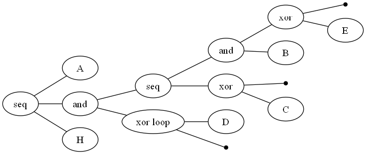
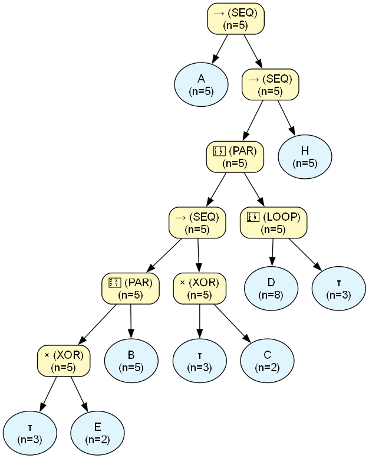
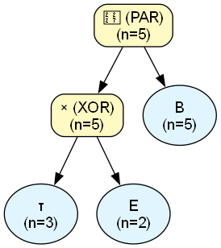
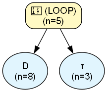
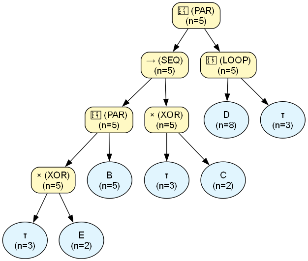

# Process Engine Audit Report

## Dataset & Audit Overview
| Metric | Value |
| :--- | :--- |
| **Dataset Name** | `test_12_skiping.csv` |
| **Noise Threshold** | `0.0` |
| **Fitness** | `N/A (skipped)` |
| **Precision** | `N/A (skipped)` |
| **Total Cases in Log** | `5` |
| **Unique Activities** | `6` |
| **XOR Operators** | `2` |
| **LOOP Operators** | `1` |
| **SEQ Operators** | `3` |
| **PAR Operators** | `2` |
| **Binarization Additions** | `1` |
| **Tau Operators Added** | `2` |
| **Total Found Patterns** | `25` |
| **Verified Patterns** | `13` |
| **Discrepancy Patterns** | `3` |
| **Ghost Patterns** | `0` |
| **Nested LOOPs** | `1` |
| **Nested PARs** | `2` |
| **Tree Exposure (Strict, End-to-End % of N)** | `0.00%` |
| **Tree Exposure (Strict, Fragment-Level % of N)** | `18.52%` |
| **Tree Exposure (Strict, Fragment-Level, >=2 activities, % of N)** | `0.00%` |
| **Tree Exposure (Local-Strict % of N)** | `88.89%` |
| **Tree Exposure (Local-Strict, >=2 activities, % of N)** | `0.00%` |
| **Total Forced Volume (incl. unresolved AS, % of N)** | `100.00%` |
| **AS-Resolved Volume (% of N)** | `0.00%` |
| **AS-Resolved Volume, PAR-only (% of N)** | `0.00%` |
| **AS-Resolved Volume, LOOP-only (% of N)** | `0.00%` |
| **AS-Opaque Volume (% of N)** | `100.00%` |
| **Data Exposure (Confirmed % of Claimed Volume)** | `92.06%` |
| **Data Exposure, ST-only (% confirmed)** | `100.00%` |
| **Data Exposure, ST + ST-in-PAR (% confirmed)** | `100.00%` |
| **Data Coverage, ST-only (% of real log)** | `37.04%` |
| **Data Coverage, ST + ST-in-PAR (% of real log)** | `100.00%` |
| **Data Coverage, Total (% of real log)** | `100.00%` |
| **Max Fractional Exposure (Worst-Case Normalized)** | `100.00%` |
| **Avg Fractional Exposure (Typical-Case Normalized)** | `100.00%` |
| **Mean Absolute Exposure Volume (events/case)** | `5.40` |

---

## Original PM4Py Tree




```text
->( 'A', +( ->( +( X( tau, 'E' ), 'B' ), X( tau, 'C' ) ), *( 'D', tau ) ), 'H' )
```

## Assimilated Master Tree




## Trace Verification

| Type | Abstract Pattern | Variations Observed | Predicted Freq | Actual Log Freq | Audit Status |
| :--- | :--- | :--- | :--- | :--- | :--- |
| `[ST]` | `A` | Exact Token Match | $\ge$ 5 | **5** | ✅ **VERIFIED** |
| `[ST (in PAR_2)]` | `τ` | Trivial (no observable event) | $\ge$ 3 | **3** | ✅ **VERIFIED** |
| `[ST (in PAR_2)]` | `E` | Exact Token Match | $\ge$ 2 | **2** | ✅ **VERIFIED** |
| `[ST (in PAR_2)]` | `B` | Exact Token Match | $\ge$ 5 | **5** | ✅ **VERIFIED** |
| `[ST (in PAR_1)]` | `C` | Exact Token Match | $\ge$ 2 | **2** | ✅ **VERIFIED** |
| `[ST (in LOOP_3)]` | `D` | Exact Token Match | $\ge$ 8 | **8** | ✅ **VERIFIED** |
| `[ST (in PAR_1)]` | `⟨D⟩` | Exact Token Match | $\ge$ 2 | **8** | ✅ **VERIFIED** |
| `[AS (in PAR_1)]` | `[nested LOOP_3]` | Exact Token Match | $\ge$ 1 | **8** | ✅ **VERIFIED** |
| `[AS]` | `[nested PAR_1]` | Exact Token Match | $\ge$ 5 | **5** | ✅ **VERIFIED** |
| `[ST]` | `H` | Exact Token Match | $\ge$ 5 | **5** | ✅ **VERIFIED** |
| `[ST]` | `⟨[nested PAR_1], H⟩` | Exact Token Match | $\ge$ 5 | **5** | ✅ **VERIFIED** |
| `[ST]` | `⟨A, [nested PAR_1], H⟩` | Exact Token Match | $\ge$ 5 | **5** | ✅ **VERIFIED** |
| `[ST]` | `⟨A, [nested PAR_1]⟩` | Exact Token Match | $\ge$ 5 | **5** | ✅ **VERIFIED** |
| `[AS (in PAR_1)]` | `[nested PAR_2]` | Exact Token Match | $\ge$ 5 | **2** | ⚠️ **DISCREPANCY** |
| `[ST (in PAR_1)]` | `⟨[nested PAR_2], τ⟩` | Exact Token Match | $\ge$ 3 | **2** | ⚠️ **DISCREPANCY** |
| `[ST (in PAR_1)]` | `⟨[nested PAR_2], C⟩` | Exact Token Match | $\ge$ 2 | **1** | ⚠️ **DISCREPANCY** |

## Audit Summary
- **Perfect Pattern Verifications:** 13
- **Frequency Discrepancies:** 3
- **Ghost Patterns (Fatal):** 0
- **Skipped (Complexity > 1000):** 0
- **Tree Exposure (Strict, End-to-End % of N):** 0.00%
- **Tree Exposure (Strict, Fragment-Level % of N):** 18.52%
- **Tree Exposure (Strict, Fragment-Level, >=2 activities, % of N):** 0.00%
- **Tree Exposure (Local-Strict % of N):** 88.89% ⚠️ *includes locally-known content inside opaque PAR/LOOP blocks -- can read near 100% even when End-to-End is 0%*
- **Tree Exposure (Local-Strict, >=2 activities, % of N):** 0.00%
- **Total Forced Volume (incl. unresolved AS, % of N):** 100.00%
- **AS-Resolved Volume (% of N):** 0.00%
- **AS-Resolved Volume, PAR-only (unordered co-occurrence, % of N):** 0.00%
- **AS-Resolved Volume, LOOP-only (unknown redo count, % of N):** 0.00%
- **AS-Opaque Volume (% of N):** 100.00%
- **Data Exposure (Confirmed % of Claimed Volume):** 92.06%
- **Data Exposure, ST-only (% of claimed ST volume confirmed in log):** 100.00%
- **Data Exposure, ST + ST-in-PAR (% of claimed volume confirmed in log):** 100.00%
- **Data Coverage, ST-only (% of real log explained by VERIFIED strict patterns):** 37.04%
- **Data Coverage, ST + ST-in-PAR (% of real log explained):** 100.00%
- **Data Coverage, Total (% of real log explained by any VERIFIED pattern):** 100.00%
- **Max Fractional Exposure (Worst-Case Normalized):** 100.00% (expected length: 7.80 events)
- **Avg Fractional Exposure (Typical-Case Normalized):** 100.00% (expected length: 5.40 events)
- **Mean Absolute Exposure Volume:** 5.40 events/case

---

## Nested Structures Reference
The following complex blocks were abstracted during the audit to prevent combinatorial explosion:\n
### `[nested PAR_2]`
- **Internal Structure:** `{[τ │ E], B}`
- **Block Frequency:** 5




### `[nested LOOP_3]`
- **Internal Structure:** `(D ∗ τ)`
- **Block Frequency:** 5

- **Max Loop Iterations:** `3`
- **Max Sub-Sequence Length:** `7` steps (if one case consumes all iterations)



### `[nested PAR_1]`
- **Internal Structure:** `{⟨{[τ │ E], B}, [τ │ C]⟩, (D ∗ τ)}`
- **Block Frequency:** 5



