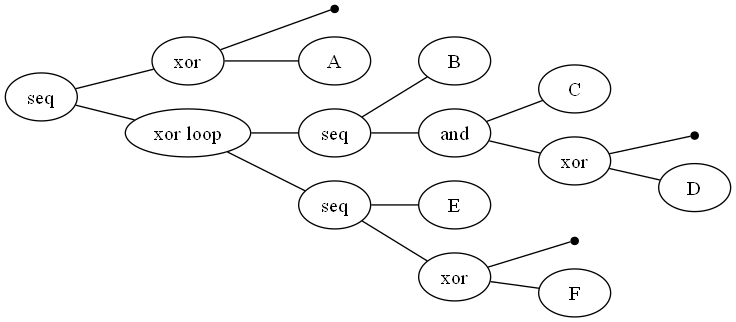
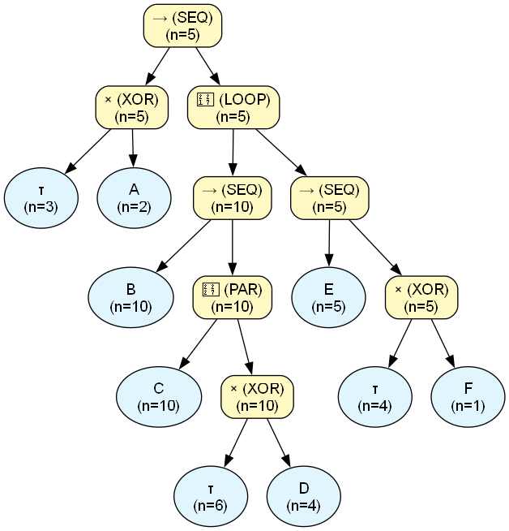
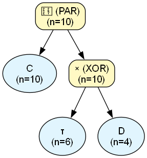
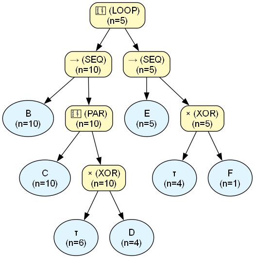

# Process Engine Audit Report

## Dataset & Audit Overview
| Metric | Value |
| :--- | :--- |
| **Dataset Name** | `test_13_deepLoop.csv` |
| **Noise Threshold** | `0.0` |
| **Fitness** | `N/A (skipped)` |
| **Precision** | `N/A (skipped)` |
| **Total Cases in Log** | `5` |
| **Unique Activities** | `6` |
| **XOR Operators** | `3` |
| **LOOP Operators** | `1` |
| **SEQ Operators** | `3` |
| **PAR Operators** | `1` |
| **Binarization Additions** | `0` |
| **Tau Operators Added** | `3` |
| **Total Found Patterns** | `20` |
| **Verified Patterns** | `14` |
| **Discrepancy Patterns** | `0` |
| **Ghost Patterns** | `0` |
| **Nested LOOPs** | `1` |
| **Nested PARs** | `1` |
| **Tree Exposure (Strict, End-to-End % of N)** | `0.00%` |
| **Tree Exposure (Strict, Fragment-Level % of N)** | `6.25%` |
| **Tree Exposure (Strict, Fragment-Level, >=2 activities, % of N)** | `0.00%` |
| **Tree Exposure (Local-Strict % of N)** | `100.00%` |
| **Tree Exposure (Local-Strict, >=2 activities, % of N)** | `6.25%` |
| **Total Forced Volume (incl. unresolved AS, % of N)** | `0.00%` |
| **AS-Resolved Volume (% of N)** | `0.00%` |
| **AS-Resolved Volume, PAR-only (% of N)** | `0.00%` |
| **AS-Resolved Volume, LOOP-only (% of N)** | `0.00%` |
| **AS-Opaque Volume (% of N)** | `0.00%` |
| **Data Exposure (Confirmed % of Claimed Volume)** | `100.00%` |
| **Data Exposure, ST-only (% confirmed)** | `100.00%` |
| **Data Exposure, ST + ST-in-PAR (% confirmed)** | `100.00%` |
| **Data Coverage, ST-only (% of real log)** | `6.25%` |
| **Data Coverage, ST + ST-in-PAR (% of real log)** | `50.00%` |
| **Data Coverage, Total (% of real log)** | `100.00%` |
| **Max Fractional Exposure (Worst-Case Normalized)** | `5.77%` |
| **Avg Fractional Exposure (Typical-Case Normalized)** | `18.75%` |
| **Mean Absolute Exposure Volume (events/case)** | `1.20` |

---

## Original PM4Py Tree




```text
->( X( tau, 'A' ), *( ->( 'B', +( 'C', X( tau, 'D' ) ) ), ->( 'E', X( tau, 'F' ) ) ) )
```

## Assimilated Master Tree




## Trace Verification

| Type | Abstract Pattern | Variations Observed | Predicted Freq | Actual Log Freq | Audit Status |
| :--- | :--- | :--- | :--- | :--- | :--- |
| `[ST]` | `τ` | Trivial (no observable event) | $\ge$ 3 | **3** | ✅ **VERIFIED** |
| `[ST]` | `A` | Exact Token Match | $\ge$ 2 | **2** | ✅ **VERIFIED** |
| `[ST (in LOOP_1)]` | `B` | Exact Token Match | $\ge$ 10 | **10** | ✅ **VERIFIED** |
| `[ST (in PAR_2)]` | `C` | Exact Token Match | $\ge$ 10 | **10** | ✅ **VERIFIED** |
| `[ST (in PAR_2)]` | `τ` | Trivial (no observable event) | $\ge$ 6 | **6** | ✅ **VERIFIED** |
| `[ST (in PAR_2)]` | `D` | Exact Token Match | $\ge$ 4 | **4** | ✅ **VERIFIED** |
| `[AS (in LOOP_1)]` | `[nested PAR_2]` | Exact Token Match | $\ge$ 10 | **10** | ✅ **VERIFIED** |
| `[ST (in LOOP_1)]` | `⟨B, [nested PAR_2]⟩` | Exact Token Match | $\ge$ 10 | **10** | ✅ **VERIFIED** |
| `[ST (in LOOP_1)]` | `E` | Exact Token Match | $\ge$ 5 | **5** | ✅ **VERIFIED** |
| `[ST (in LOOP_1)]` | `τ` | Trivial (no observable event) | $\ge$ 4 | **4** | ✅ **VERIFIED** |
| `[ST (in LOOP_1)]` | `F` | Exact Token Match | $\ge$ 1 | **1** | ✅ **VERIFIED** |
| `[ST (in LOOP_1)]` | `⟨E, τ⟩` | Exact Token Match | $\ge$ 4 | **5** | ✅ **VERIFIED** |
| `[ST (in LOOP_1)]` | `⟨E, F⟩` | Exact Token Match | $\ge$ 1 | **1** | ✅ **VERIFIED** |
| `[AS]` | `[nested LOOP_1]` | Exact Token Match | $\ge$ 1 | **5** | ✅ **VERIFIED** |

## Audit Summary
- **Perfect Pattern Verifications:** 14
- **Frequency Discrepancies:** 0
- **Ghost Patterns (Fatal):** 0
- **Skipped (Complexity > 1000):** 0
- **Tree Exposure (Strict, End-to-End % of N):** 0.00%
- **Tree Exposure (Strict, Fragment-Level % of N):** 6.25%
- **Tree Exposure (Strict, Fragment-Level, >=2 activities, % of N):** 0.00%
- **Tree Exposure (Local-Strict % of N):** 100.00% ⚠️ *includes locally-known content inside opaque PAR/LOOP blocks -- can read near 100% even when End-to-End is 0%*
- **Tree Exposure (Local-Strict, >=2 activities, % of N):** 6.25%
- **Total Forced Volume (incl. unresolved AS, % of N):** 0.00%
- **AS-Resolved Volume (% of N):** 0.00%
- **AS-Resolved Volume, PAR-only (unordered co-occurrence, % of N):** 0.00%
- **AS-Resolved Volume, LOOP-only (unknown redo count, % of N):** 0.00%
- **AS-Opaque Volume (% of N):** 0.00%
- **Data Exposure (Confirmed % of Claimed Volume):** 100.00%
- **Data Exposure, ST-only (% of claimed ST volume confirmed in log):** 100.00%
- **Data Exposure, ST + ST-in-PAR (% of claimed volume confirmed in log):** 100.00%
- **Data Coverage, ST-only (% of real log explained by VERIFIED strict patterns):** 6.25%
- **Data Coverage, ST + ST-in-PAR (% of real log explained):** 50.00%
- **Data Coverage, Total (% of real log explained by any VERIFIED pattern):** 100.00%
- **Max Fractional Exposure (Worst-Case Normalized):** 5.77% (expected length: 20.80 events)
- **Avg Fractional Exposure (Typical-Case Normalized):** 18.75% (expected length: 6.40 events)
- **Mean Absolute Exposure Volume:** 1.20 events/case

---

## Nested Structures Reference
The following complex blocks were abstracted during the audit to prevent combinatorial explosion:\n
### `[nested PAR_2]`
- **Internal Structure:** `{C, [τ │ D]}`
- **Block Frequency:** 10




### `[nested LOOP_1]`
- **Internal Structure:** `(⟨B, {C, [τ │ D]}⟩ ∗ ⟨E, [τ │ F]⟩)`
- **Block Frequency:** 5

- **Max Loop Iterations:** `5`
- **Max Sub-Sequence Length:** `11` steps (if one case consumes all iterations)


