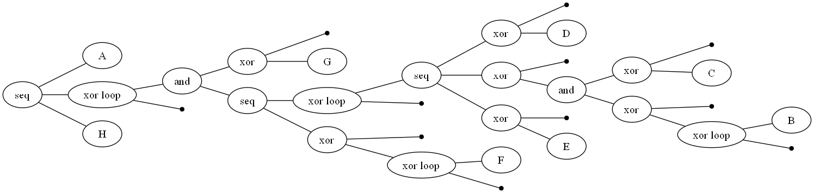
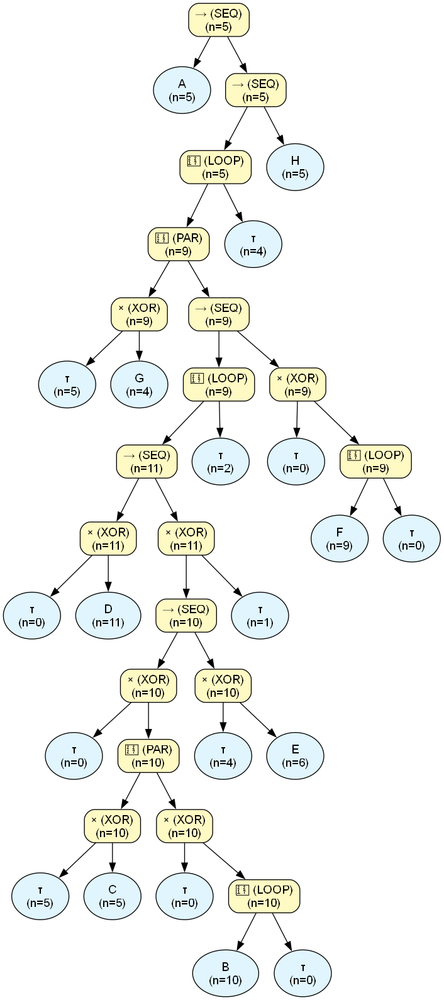
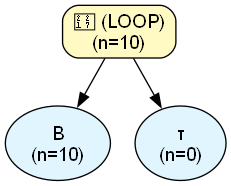
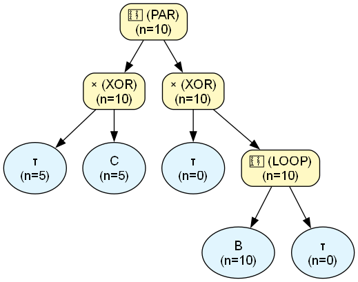
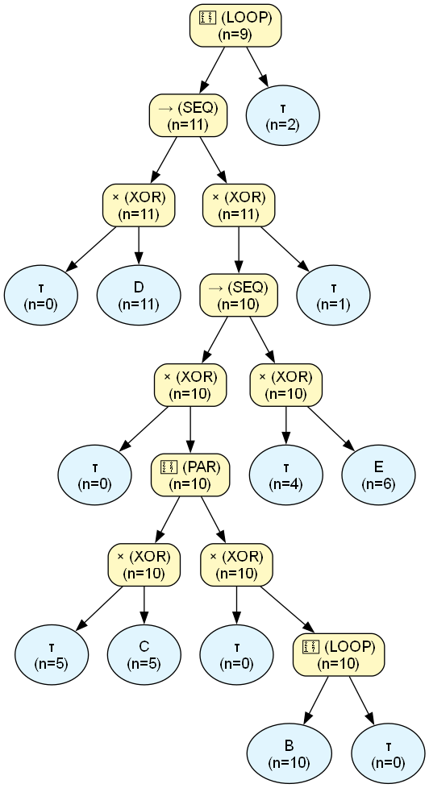
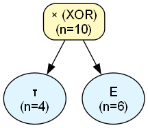
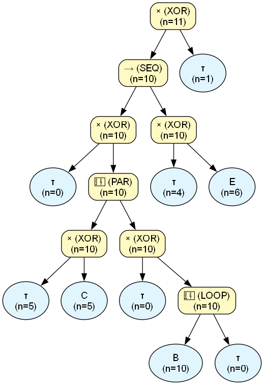
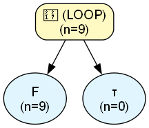
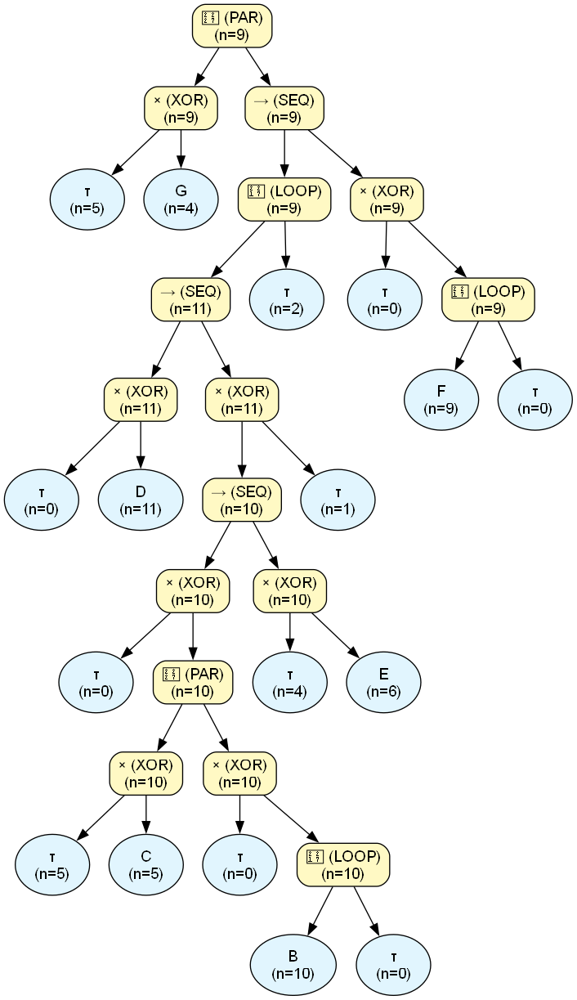
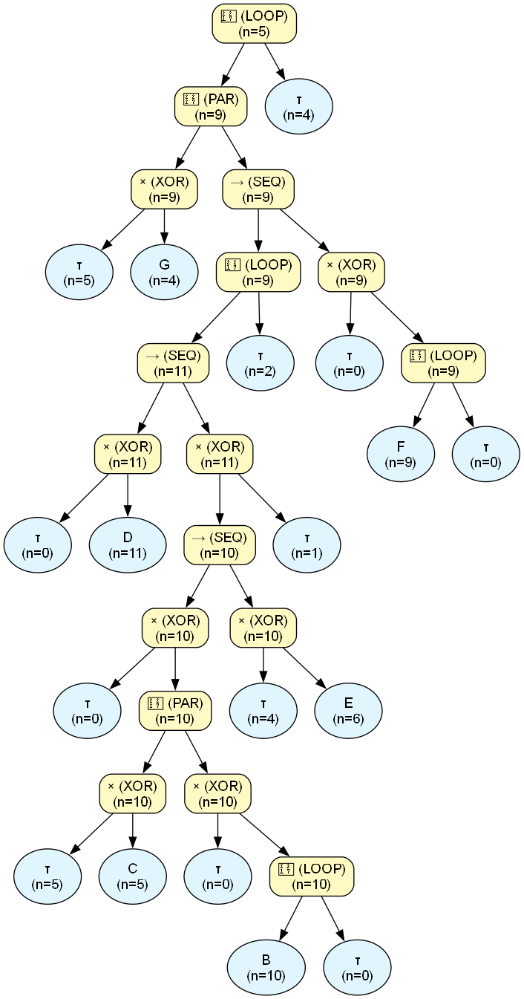

# Process Engine Audit Report

## Dataset & Audit Overview
| Metric | Value |
| :--- | :--- |
| **Dataset Name** | `test_15_loop3.csv` |
| **Noise Threshold** | `0.0` |
| **Fitness** | `N/A (skipped)` |
| **Precision** | `N/A (skipped)` |
| **Total Cases in Log** | `5` |
| **Unique Activities** | `8` |
| **XOR Operators** | `8` |
| **LOOP Operators** | `4` |
| **SEQ Operators** | `5` |
| **PAR Operators** | `2` |
| **Binarization Additions** | `2` |
| **Tau Operators Added** | `10` |
| **Total Found Patterns** | `64` |
| **Verified Patterns** | `33` |
| **Discrepancy Patterns** | `4` |
| **Ghost Patterns** | `0` |
| **Nested LOOPs** | `4` |
| **Nested PARs** | `2` |
| **Tree Exposure (Strict, End-to-End % of N)** | `0.00%` |
| **Tree Exposure (Strict, Fragment-Level % of N)** | `9.09%` |
| **Tree Exposure (Strict, Fragment-Level, >=2 activities, % of N)** | `0.00%` |
| **Tree Exposure (Local-Strict % of N)** | `100.00%` |
| **Tree Exposure (Local-Strict, >=2 activities, % of N)** | `0.00%` |
| **Total Forced Volume (incl. unresolved AS, % of N)** | `40.00%` |
| **AS-Resolved Volume (% of N)** | `0.00%` |
| **AS-Resolved Volume, PAR-only (% of N)** | `0.00%` |
| **AS-Resolved Volume, LOOP-only (% of N)** | `0.00%` |
| **AS-Opaque Volume (% of N)** | `40.00%` |
| **Data Exposure (Confirmed % of Claimed Volume)** | `90.51%` |
| **Data Exposure, ST-only (% confirmed)** | `100.00%` |
| **Data Exposure, ST + ST-in-PAR (% confirmed)** | `100.00%` |
| **Data Coverage, ST-only (% of real log)** | `18.18%` |
| **Data Coverage, ST + ST-in-PAR (% of real log)** | `69.09%` |
| **Data Coverage, Total (% of real log)** | `100.00%` |
| **Max Fractional Exposure (Worst-Case Normalized)** | `57.24%` |
| **Avg Fractional Exposure (Typical-Case Normalized)** | `77.24%` |
| **Mean Absolute Exposure Volume (events/case)** | `5.25` |

---

## Original PM4Py Tree




```text
->( 'A', *( +( X( tau, 'G' ), ->( *( ->( X( tau, 'D' ), X( tau, +( X( tau, 'C' ), X( tau, *( 'B', tau ) ) ) ), X( tau, 'E' ) ), tau ), X( tau, *( 'F', tau ) ) ) ), tau ), 'H' )
```

## Assimilated Master Tree




## Trace Verification

| Type | Abstract Pattern | Variations Observed | Predicted Freq | Actual Log Freq | Audit Status |
| :--- | :--- | :--- | :--- | :--- | :--- |
| `[ST]` | `A` | Exact Token Match | $\ge$ 5 | **5** | ✅ **VERIFIED** |
| `[ST (in PAR_2)]` | `τ` | Trivial (no observable event) | $\ge$ 5 | **5** | ✅ **VERIFIED** |
| `[ST (in PAR_2)]` | `G` | Exact Token Match | $\ge$ 4 | **4** | ✅ **VERIFIED** |
| `[ST (in LOOP_3)]` | `D` | Exact Token Match | $\ge$ 11 | **11** | ✅ **VERIFIED** |
| `[ST (in PAR_4)]` | `C` | Exact Token Match | $\ge$ 5 | **5** | ✅ **VERIFIED** |
| `[ST (in LOOP_5)]` | `B` | Exact Token Match | $\ge$ 10 | **10** | ✅ **VERIFIED** |
| `[ST (in PAR_4)]` | `⟨B⟩` | Exact Token Match | $\ge$ 10 | **10** | ✅ **VERIFIED** |
| `[AS (in LOOP_3)]` | `[nested PAR_4]` | Exact Token Match | $\ge$ 10 | **10** | ✅ **VERIFIED** |
| `[ST (in LOOP_3)]` | `τ` | Trivial (no observable event) | $\ge$ 4 | **4** | ✅ **VERIFIED** |
| `[ST (in LOOP_3)]` | `E` | Exact Token Match | $\ge$ 6 | **6** | ✅ **VERIFIED** |
| `[ST (in LOOP_3)]` | `⟨[nested PAR_4], τ⟩` | Exact Token Match | $\ge$ 4 | **10** | ✅ **VERIFIED** |
| `[ST (in LOOP_3)]` | `τ` | Trivial (no observable event) | $\ge$ 1 | **1** | ✅ **VERIFIED** |
| `[ST (in LOOP_3)]` | `⟨D, [nested PAR_4], τ⟩` | Exact Token Match | $\ge$ 4 | **4** | ✅ **VERIFIED** |
| `[ST (in LOOP_3)]` | `⟨D, τ⟩` | Exact Token Match | $\ge$ 1 | **11** | ✅ **VERIFIED** |
| `[ST (in PAR_2)]` | `⟨D, [nested PAR_4], E⟩` | Exact Token Match | $\ge$ 2 | **5** | ✅ **VERIFIED** |
| `[ST (in PAR_2)]` | `⟨D, [nested PAR_4], [nested XOR_6]⟩` | Exact Token Match | $\ge$ 4.0 | **5** | ✅ **VERIFIED** |
| `[ST (in PAR_2)]` | `⟨D, [nested XOR_7]⟩` | Exact Token Match | $\ge$ 1.0 | **5** | ✅ **VERIFIED** |
| `[AS (in PAR_2)]` | `[nested LOOP_3]` | Exact Token Match | $\ge$ 1 | **5** | ✅ **VERIFIED** |
| `[ST (in LOOP_8)]` | `F` | Exact Token Match | $\ge$ 9 | **9** | ✅ **VERIFIED** |
| `[ST (in PAR_2)]` | `⟨F⟩` | Exact Token Match | $\ge$ 9 | **9** | ✅ **VERIFIED** |
| `[ST (in PAR_2)]` | `⟨D, [nested PAR_4], E, F⟩` | Exact Token Match | $\ge$ 2 | **5** | ✅ **VERIFIED** |
| `[ST (in PAR_2)]` | `⟨D, [nested PAR_4], [nested XOR_6], F⟩` | Exact Token Match | $\ge$ 4.0 | **5** | ✅ **VERIFIED** |
| `[ST (in PAR_2)]` | `⟨D, [nested XOR_7], F⟩` | Exact Token Match | $\ge$ 1.0 | **5** | ✅ **VERIFIED** |
| `[ST (in PAR_2)]` | `⟨[nested LOOP_3], F⟩` | Exact Token Match | $\ge$ 1 | **5** | ✅ **VERIFIED** |
| `[AS]` | `⟨[nested PAR_2]⟩` | Exact Token Match | $\ge$ 1 | **5** | ✅ **VERIFIED** |
| `[AS]` | `[nested LOOP_1]` | Exact Token Match | $\ge$ 1 | **5** | ✅ **VERIFIED** |
| `[ST]` | `H` | Exact Token Match | $\ge$ 5 | **5** | ✅ **VERIFIED** |
| `[ST]` | `⟨[nested PAR_2], H⟩` | Exact Token Match | $\ge$ 1 | **5** | ✅ **VERIFIED** |
| `[ST]` | `⟨[nested LOOP_1], H⟩` | Exact Token Match | $\ge$ 1 | **5** | ✅ **VERIFIED** |
| `[ST]` | `⟨A, [nested PAR_2], H⟩` | Exact Token Match | $\ge$ 1 | **5** | ✅ **VERIFIED** |
| `[ST]` | `⟨A, [nested LOOP_1], H⟩` | Exact Token Match | $\ge$ 1 | **5** | ✅ **VERIFIED** |
| `[ST]` | `⟨A, [nested PAR_2]⟩` | Exact Token Match | $\ge$ 1 | **5** | ✅ **VERIFIED** |
| `[ST]` | `⟨A, [nested LOOP_1]⟩` | Exact Token Match | $\ge$ 1 | **5** | ✅ **VERIFIED** |
| `[ST (in LOOP_3)]` | `⟨[nested PAR_4], E⟩` | Exact Token Match | $\ge$ 6 | **4** | ⚠️ **DISCREPANCY** |
| `[ST (in LOOP_3)]` | `⟨D, [nested PAR_4], E⟩` | Exact Token Match | $\ge$ 6 | **3** | ⚠️ **DISCREPANCY** |
| `[ST (in LOOP_3)]` | `⟨D, [nested PAR_4]⟩` | Exact Token Match | $\ge$ 10 | **4** | ⚠️ **DISCREPANCY** |
| `[AS (in LOOP_1)]` | `[nested PAR_2]` | Exact Token Match | $\ge$ 9 | **5** | ⚠️ **DISCREPANCY** |

## Audit Summary
- **Perfect Pattern Verifications:** 33
- **Frequency Discrepancies:** 4
- **Ghost Patterns (Fatal):** 0
- **Skipped (Complexity > 1000):** 0
- **Tree Exposure (Strict, End-to-End % of N):** 0.00%
- **Tree Exposure (Strict, Fragment-Level % of N):** 9.09%
- **Tree Exposure (Strict, Fragment-Level, >=2 activities, % of N):** 0.00%
- **Tree Exposure (Local-Strict % of N):** 100.00% ⚠️ *includes locally-known content inside opaque PAR/LOOP blocks -- can read near 100% even when End-to-End is 0%*
- **Tree Exposure (Local-Strict, >=2 activities, % of N):** 0.00%
- **Total Forced Volume (incl. unresolved AS, % of N):** 40.00%
- **AS-Resolved Volume (% of N):** 0.00%
- **AS-Resolved Volume, PAR-only (unordered co-occurrence, % of N):** 0.00%
- **AS-Resolved Volume, LOOP-only (unknown redo count, % of N):** 0.00%
- **AS-Opaque Volume (% of N):** 40.00%
- **Data Exposure (Confirmed % of Claimed Volume):** 90.51%
- **Data Exposure, ST-only (% of claimed ST volume confirmed in log):** 100.00%
- **Data Exposure, ST + ST-in-PAR (% of claimed volume confirmed in log):** 100.00%
- **Data Coverage, ST-only (% of real log explained by VERIFIED strict patterns):** 18.18%
- **Data Coverage, ST + ST-in-PAR (% of real log explained):** 69.09%
- **Data Coverage, Total (% of real log explained by any VERIFIED pattern):** 100.00%
- **Max Fractional Exposure (Worst-Case Normalized):** 57.24% (expected length: 23.77 events)
- **Avg Fractional Exposure (Typical-Case Normalized):** 77.24% (expected length: 11.00 events)
- **Mean Absolute Exposure Volume:** 5.25 events/case

---

## Nested Structures Reference
The following complex blocks were abstracted during the audit to prevent combinatorial explosion:\n
### `[nested LOOP_5]`
- **Internal Structure:** `(B ∗ τ)`
- **Block Frequency:** 10

- **Max Loop Iterations:** `0`
- **Max Sub-Sequence Length:** `1` steps (if one case consumes all iterations)



### `[nested PAR_4]`
- **Internal Structure:** `{[τ │ C], [τ │ (B ∗ τ)]}`
- **Block Frequency:** 10




### `[nested LOOP_3]`
- **Internal Structure:** `(⟨[τ │ D], [⟨[τ │ {[τ │ C], [τ │ (B ∗ τ)]}], [τ │ E]⟩ │ τ]⟩ ∗ τ)`
- **Block Frequency:** 9

- **Max Loop Iterations:** `2`
- **Max Sub-Sequence Length:** `5` steps (if one case consumes all iterations)



### `[nested XOR_6]`
- **Internal Structure:** `[τ │ E]`
- **Block Frequency:** 10




### `[nested XOR_7]`
- **Internal Structure:** `[⟨[τ │ {[τ │ C], [τ │ (B ∗ τ)]}], [τ │ E]⟩ │ τ]`
- **Block Frequency:** 11




### `[nested LOOP_8]`
- **Internal Structure:** `(F ∗ τ)`
- **Block Frequency:** 9

- **Max Loop Iterations:** `0`
- **Max Sub-Sequence Length:** `1` steps (if one case consumes all iterations)



### `[nested PAR_2]`
- **Internal Structure:** `{[τ │ G], ⟨(⟨[τ │ D], [⟨[τ │ {[τ │ C], [τ │ (B ∗ τ)]}], [τ │ E]⟩ │ τ]⟩ ∗ τ), [τ │ (F ∗ τ)]⟩}`
- **Block Frequency:** 9




### `[nested LOOP_1]`
- **Internal Structure:** `({[τ │ G], ⟨(⟨[τ │ D], [⟨[τ │ {[τ │ C], [τ │ (B ∗ τ)]}], [τ │ E]⟩ │ τ]⟩ ∗ τ), [τ │ (F ∗ τ)]⟩} ∗ τ)`
- **Block Frequency:** 5

- **Max Loop Iterations:** `4`
- **Max Sub-Sequence Length:** `9` steps (if one case consumes all iterations)


