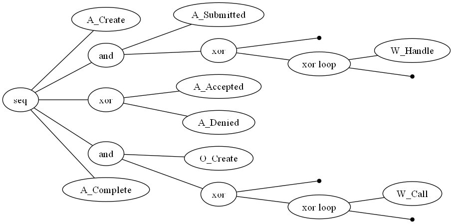
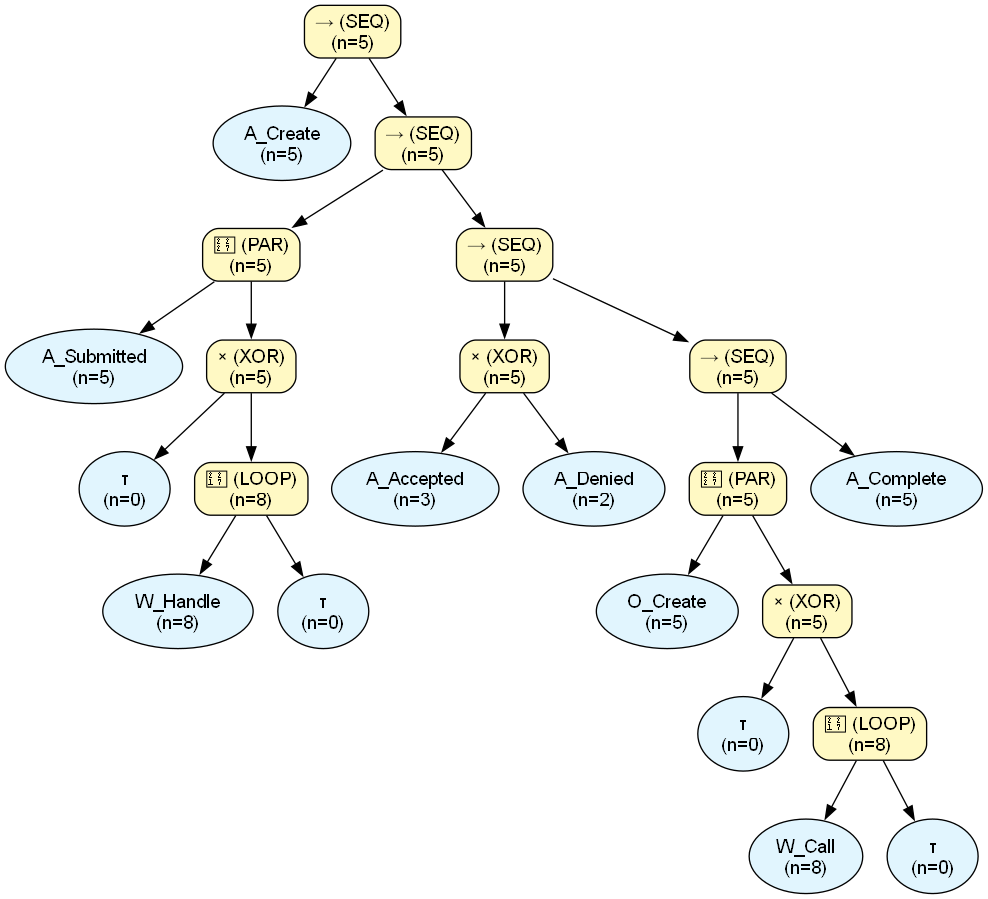
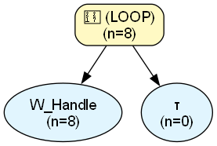
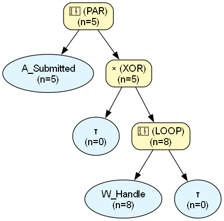
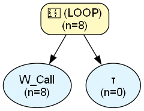
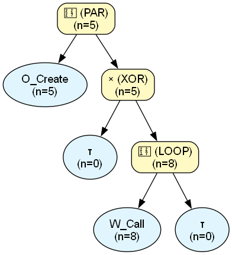

# Process Engine Audit Report

## Dataset & Audit Overview
| Metric | Value |
| :--- | :--- |
| **Dataset Name** | `test_17_spagetti.csv` |
| **Noise Threshold** | `0.0` |
| **Fitness** | `N/A (skipped)` |
| **Precision** | `N/A (skipped)` |
| **Total Cases in Log** | `5` |
| **Unique Activities** | `8` |
| **XOR Operators** | `3` |
| **LOOP Operators** | `2` |
| **SEQ Operators** | `4` |
| **PAR Operators** | `2` |
| **Binarization Additions** | `3` |
| **Tau Operators Added** | `0` |
| **Total Found Patterns** | `44` |
| **Verified Patterns** | `30` |
| **Discrepancy Patterns** | `0` |
| **Ghost Patterns** | `0` |
| **Nested LOOPs** | `2` |
| **Nested PARs** | `2` |
| **Tree Exposure (Strict, End-to-End % of N)** | `0.00%` |
| **Tree Exposure (Strict, Fragment-Level % of N)** | `14.29%` |
| **Tree Exposure (Strict, Fragment-Level, >=2 activities, % of N)** | `0.00%` |
| **Tree Exposure (Local-Strict % of N)** | `100.00%` |
| **Tree Exposure (Local-Strict, >=2 activities, % of N)** | `0.00%` |
| **Total Forced Volume (incl. unresolved AS, % of N)** | `100.00%` |
| **AS-Resolved Volume (% of N)** | `0.00%` |
| **AS-Resolved Volume, PAR-only (% of N)** | `0.00%` |
| **AS-Resolved Volume, LOOP-only (% of N)** | `0.00%` |
| **AS-Opaque Volume (% of N)** | `100.00%` |
| **Data Exposure (Confirmed % of Claimed Volume)** | `100.00%` |
| **Data Exposure, ST-only (% confirmed)** | `100.00%` |
| **Data Exposure, ST + ST-in-PAR (% confirmed)** | `100.00%` |
| **Data Coverage, ST-only (% of real log)** | `36.59%` |
| **Data Coverage, ST + ST-in-PAR (% of real log)** | `100.00%` |
| **Data Coverage, Total (% of real log)** | `100.00%` |
| **Max Fractional Exposure (Worst-Case Normalized)** | `100.00%` |
| **Avg Fractional Exposure (Typical-Case Normalized)** | `100.00%` |
| **Mean Absolute Exposure Volume (events/case)** | `7.00` |

---

## Original PM4Py Tree




```text
->( 'A_Create', +( 'A_Submitted', X( tau, *( 'W_Handle', tau ) ) ), X( 'A_Accepted', 'A_Denied' ), +( 'O_Create', X( tau, *( 'W_Call', tau ) ) ), 'A_Complete' )
```

## Assimilated Master Tree




## Trace Verification

| Type | Abstract Pattern | Variations Observed | Predicted Freq | Actual Log Freq | Audit Status |
| :--- | :--- | :--- | :--- | :--- | :--- |
| `[ST]` | `A_Create` | Exact Token Match | $\ge$ 5 | **5** | ✅ **VERIFIED** |
| `[ST (in PAR_1)]` | `A_Submitted` | Exact Token Match | $\ge$ 5 | **5** | ✅ **VERIFIED** |
| `[ST (in LOOP_2)]` | `W_Handle` | Exact Token Match | $\ge$ 8 | **8** | ✅ **VERIFIED** |
| `[ST (in PAR_1)]` | `⟨W_Handle⟩` | Exact Token Match | $\ge$ 8 | **8** | ✅ **VERIFIED** |
| `[AS]` | `[nested PAR_1]` | Exact Token Match | $\ge$ 5 | **5** | ✅ **VERIFIED** |
| `[ST]` | `A_Accepted` | Exact Token Match | $\ge$ 3 | **3** | ✅ **VERIFIED** |
| `[ST]` | `A_Denied` | Exact Token Match | $\ge$ 2 | **2** | ✅ **VERIFIED** |
| `[ST (in PAR_3)]` | `O_Create` | Exact Token Match | $\ge$ 5 | **5** | ✅ **VERIFIED** |
| `[ST (in LOOP_4)]` | `W_Call` | Exact Token Match | $\ge$ 8 | **8** | ✅ **VERIFIED** |
| `[ST (in PAR_3)]` | `⟨W_Call⟩` | Exact Token Match | $\ge$ 8 | **8** | ✅ **VERIFIED** |
| `[AS]` | `[nested PAR_3]` | Exact Token Match | $\ge$ 5 | **5** | ✅ **VERIFIED** |
| `[ST]` | `A_Complete` | Exact Token Match | $\ge$ 5 | **5** | ✅ **VERIFIED** |
| `[ST]` | `⟨[nested PAR_3], A_Complete⟩` | Exact Token Match | $\ge$ 5 | **5** | ✅ **VERIFIED** |
| `[ST]` | `⟨A_Accepted, [nested PAR_3], A_Complete⟩` | Exact Token Match | $\ge$ 3 | **3** | ✅ **VERIFIED** |
| `[ST]` | `⟨A_Denied, [nested PAR_3], A_Complete⟩` | Exact Token Match | $\ge$ 2 | **2** | ✅ **VERIFIED** |
| `[ST]` | `⟨A_Accepted, [nested PAR_3]⟩` | Exact Token Match | $\ge$ 3 | **3** | ✅ **VERIFIED** |
| `[ST]` | `⟨A_Denied, [nested PAR_3]⟩` | Exact Token Match | $\ge$ 2 | **2** | ✅ **VERIFIED** |
| `[ST]` | `⟨[nested PAR_1], A_Accepted, [nested PAR_3], A_Complete⟩` | Exact Token Match | $\ge$ 3 | **3** | ✅ **VERIFIED** |
| `[ST]` | `⟨[nested PAR_1], A_Denied, [nested PAR_3], A_Complete⟩` | Exact Token Match | $\ge$ 2 | **2** | ✅ **VERIFIED** |
| `[ST]` | `⟨[nested PAR_1], A_Accepted, [nested PAR_3]⟩` | Exact Token Match | $\ge$ 3 | **3** | ✅ **VERIFIED** |
| `[ST]` | `⟨[nested PAR_1], A_Denied, [nested PAR_3]⟩` | Exact Token Match | $\ge$ 2 | **2** | ✅ **VERIFIED** |
| `[ST]` | `⟨[nested PAR_1], A_Accepted⟩` | Exact Token Match | $\ge$ 3 | **3** | ✅ **VERIFIED** |
| `[ST]` | `⟨[nested PAR_1], A_Denied⟩` | Exact Token Match | $\ge$ 2 | **2** | ✅ **VERIFIED** |
| `[ST]` | `⟨A_Create, [nested PAR_1], A_Accepted, [nested PAR_3], A_Complete⟩` | Exact Token Match | $\ge$ 3 | **3** | ✅ **VERIFIED** |
| `[ST]` | `⟨A_Create, [nested PAR_1], A_Denied, [nested PAR_3], A_Complete⟩` | Exact Token Match | $\ge$ 2 | **2** | ✅ **VERIFIED** |
| `[ST]` | `⟨A_Create, [nested PAR_1], A_Accepted, [nested PAR_3]⟩` | Exact Token Match | $\ge$ 3 | **3** | ✅ **VERIFIED** |
| `[ST]` | `⟨A_Create, [nested PAR_1], A_Denied, [nested PAR_3]⟩` | Exact Token Match | $\ge$ 2 | **2** | ✅ **VERIFIED** |
| `[ST]` | `⟨A_Create, [nested PAR_1], A_Accepted⟩` | Exact Token Match | $\ge$ 3 | **3** | ✅ **VERIFIED** |
| `[ST]` | `⟨A_Create, [nested PAR_1], A_Denied⟩` | Exact Token Match | $\ge$ 2 | **2** | ✅ **VERIFIED** |
| `[ST]` | `⟨A_Create, [nested PAR_1]⟩` | Exact Token Match | $\ge$ 5 | **5** | ✅ **VERIFIED** |

## Audit Summary
- **Perfect Pattern Verifications:** 30
- **Frequency Discrepancies:** 0
- **Ghost Patterns (Fatal):** 0
- **Skipped (Complexity > 1000):** 0
- **Tree Exposure (Strict, End-to-End % of N):** 0.00%
- **Tree Exposure (Strict, Fragment-Level % of N):** 14.29%
- **Tree Exposure (Strict, Fragment-Level, >=2 activities, % of N):** 0.00%
- **Tree Exposure (Local-Strict % of N):** 100.00% ⚠️ *includes locally-known content inside opaque PAR/LOOP blocks -- can read near 100% even when End-to-End is 0%*
- **Tree Exposure (Local-Strict, >=2 activities, % of N):** 0.00%
- **Total Forced Volume (incl. unresolved AS, % of N):** 100.00%
- **AS-Resolved Volume (% of N):** 0.00%
- **AS-Resolved Volume, PAR-only (unordered co-occurrence, % of N):** 0.00%
- **AS-Resolved Volume, LOOP-only (unknown redo count, % of N):** 0.00%
- **AS-Opaque Volume (% of N):** 100.00%
- **Data Exposure (Confirmed % of Claimed Volume):** 100.00%
- **Data Exposure, ST-only (% of claimed ST volume confirmed in log):** 100.00%
- **Data Exposure, ST + ST-in-PAR (% of claimed volume confirmed in log):** 100.00%
- **Data Coverage, ST-only (% of real log explained by VERIFIED strict patterns):** 36.59%
- **Data Coverage, ST + ST-in-PAR (% of real log explained):** 100.00%
- **Data Coverage, Total (% of real log explained by any VERIFIED pattern):** 100.00%
- **Max Fractional Exposure (Worst-Case Normalized):** 100.00% (expected length: 7.00 events)
- **Avg Fractional Exposure (Typical-Case Normalized):** 100.00% (expected length: 7.00 events)
- **Mean Absolute Exposure Volume:** 7.00 events/case

---

## Nested Structures Reference
The following complex blocks were abstracted during the audit to prevent combinatorial explosion:\n
### `[nested LOOP_2]`
- **Internal Structure:** `(W_Handle ∗ τ)`
- **Block Frequency:** 8

- **Max Loop Iterations:** `0`
- **Max Sub-Sequence Length:** `1` steps (if one case consumes all iterations)



### `[nested PAR_1]`
- **Internal Structure:** `{A_Submitted, [τ │ (W_Handle ∗ τ)]}`
- **Block Frequency:** 5




### `[nested LOOP_4]`
- **Internal Structure:** `(W_Call ∗ τ)`
- **Block Frequency:** 8

- **Max Loop Iterations:** `0`
- **Max Sub-Sequence Length:** `1` steps (if one case consumes all iterations)



### `[nested PAR_3]`
- **Internal Structure:** `{O_Create, [τ │ (W_Call ∗ τ)]}`
- **Block Frequency:** 5



