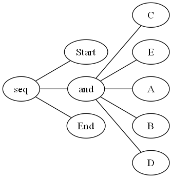
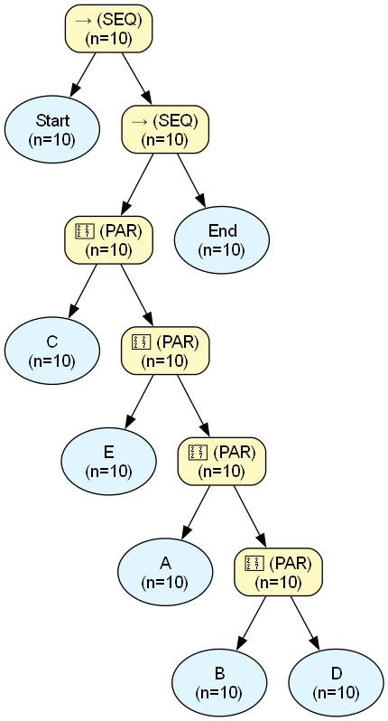
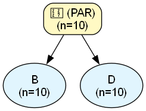
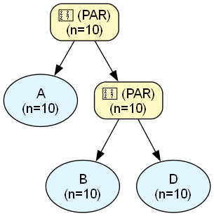
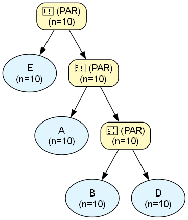
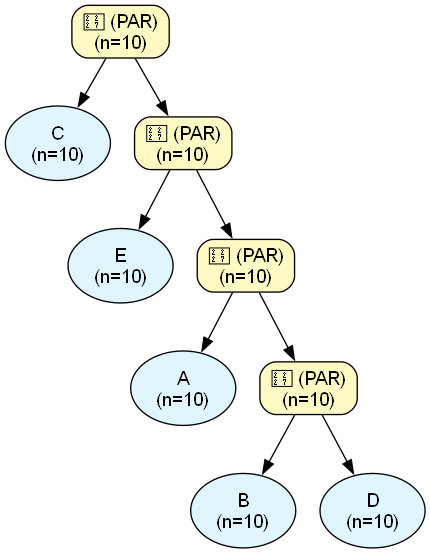

# Process Engine Audit Report

## Dataset & Audit Overview
| Metric | Value |
| :--- | :--- |
| **Dataset Name** | `test_22_precTest.csv` |
| **Noise Threshold** | `0.0` |
| **Fitness** | `N/A (skipped)` |
| **Precision** | `N/A (skipped)` |
| **Total Cases in Log** | `10` |
| **Unique Activities** | `7` |
| **XOR Operators** | `0` |
| **LOOP Operators** | `0` |
| **SEQ Operators** | `2` |
| **PAR Operators** | `4` |
| **Binarization Additions** | `4` |
| **Tau Operators Added** | `0` |
| **Total Found Patterns** | `18` |
| **Verified Patterns** | `14` |
| **Discrepancy Patterns** | `0` |
| **Ghost Patterns** | `0` |
| **Nested LOOPs** | `0` |
| **Nested PARs** | `4` |
| **Tree Exposure (Strict, End-to-End % of N)** | `0.00%` |
| **Tree Exposure (Strict, Fragment-Level % of N)** | `14.29%` |
| **Tree Exposure (Strict, Fragment-Level, >=2 activities, % of N)** | `0.00%` |
| **Tree Exposure (Local-Strict % of N)** | `85.71%` |
| **Tree Exposure (Local-Strict, >=2 activities, % of N)** | `0.00%` |
| **Total Forced Volume (incl. unresolved AS, % of N)** | `100.00%` |
| **AS-Resolved Volume (% of N)** | `0.00%` |
| **AS-Resolved Volume, PAR-only (% of N)** | `0.00%` |
| **AS-Resolved Volume, LOOP-only (% of N)** | `0.00%` |
| **AS-Opaque Volume (% of N)** | `100.00%` |
| **Data Exposure (Confirmed % of Claimed Volume)** | `100.00%` |
| **Data Exposure, ST-only (% confirmed)** | `100.00%` |
| **Data Exposure, ST + ST-in-PAR (% confirmed)** | `100.00%` |
| **Data Coverage, ST-only (% of real log)** | `28.57%` |
| **Data Coverage, ST + ST-in-PAR (% of real log)** | `100.00%` |
| **Data Coverage, Total (% of real log)** | `100.00%` |
| **Max Fractional Exposure (Worst-Case Normalized)** | `100.00%` |
| **Avg Fractional Exposure (Typical-Case Normalized)** | `100.00%` |
| **Mean Absolute Exposure Volume (events/case)** | `7.00` |

---

## Original PM4Py Tree




```text
->( 'Start', +( 'C', 'E', 'A', 'B', 'D' ), 'End' )
```

## Assimilated Master Tree




## Trace Verification

| Type | Abstract Pattern | Variations Observed | Predicted Freq | Actual Log Freq | Audit Status |
| :--- | :--- | :--- | :--- | :--- | :--- |
| `[ST]` | `Start` | Exact Token Match | $\ge$ 10 | **10** | ✅ **VERIFIED** |
| `[ST (in PAR_1)]` | `C` | Exact Token Match | $\ge$ 10 | **10** | ✅ **VERIFIED** |
| `[ST (in PAR_2)]` | `E` | Exact Token Match | $\ge$ 10 | **10** | ✅ **VERIFIED** |
| `[ST (in PAR_3)]` | `A` | Exact Token Match | $\ge$ 10 | **10** | ✅ **VERIFIED** |
| `[ST (in PAR_4)]` | `B` | Exact Token Match | $\ge$ 10 | **10** | ✅ **VERIFIED** |
| `[ST (in PAR_4)]` | `D` | Exact Token Match | $\ge$ 10 | **10** | ✅ **VERIFIED** |
| `[AS (in PAR_3)]` | `[nested PAR_4]` | Exact Token Match | $\ge$ 10 | **10** | ✅ **VERIFIED** |
| `[AS (in PAR_2)]` | `[nested PAR_3]` | Exact Token Match | $\ge$ 10 | **10** | ✅ **VERIFIED** |
| `[AS (in PAR_1)]` | `[nested PAR_2]` | Exact Token Match | $\ge$ 10 | **10** | ✅ **VERIFIED** |
| `[AS]` | `[nested PAR_1]` | Exact Token Match | $\ge$ 10 | **10** | ✅ **VERIFIED** |
| `[ST]` | `End` | Exact Token Match | $\ge$ 10 | **10** | ✅ **VERIFIED** |
| `[ST]` | `⟨[nested PAR_1], End⟩` | Exact Token Match | $\ge$ 10 | **10** | ✅ **VERIFIED** |
| `[ST]` | `⟨Start, [nested PAR_1], End⟩` | Exact Token Match | $\ge$ 10 | **10** | ✅ **VERIFIED** |
| `[ST]` | `⟨Start, [nested PAR_1]⟩` | Exact Token Match | $\ge$ 10 | **10** | ✅ **VERIFIED** |

## Audit Summary
- **Perfect Pattern Verifications:** 14
- **Frequency Discrepancies:** 0
- **Ghost Patterns (Fatal):** 0
- **Skipped (Complexity > 1000):** 0
- **Tree Exposure (Strict, End-to-End % of N):** 0.00%
- **Tree Exposure (Strict, Fragment-Level % of N):** 14.29%
- **Tree Exposure (Strict, Fragment-Level, >=2 activities, % of N):** 0.00%
- **Tree Exposure (Local-Strict % of N):** 85.71% ⚠️ *includes locally-known content inside opaque PAR/LOOP blocks -- can read near 100% even when End-to-End is 0%*
- **Tree Exposure (Local-Strict, >=2 activities, % of N):** 0.00%
- **Total Forced Volume (incl. unresolved AS, % of N):** 100.00%
- **AS-Resolved Volume (% of N):** 0.00%
- **AS-Resolved Volume, PAR-only (unordered co-occurrence, % of N):** 0.00%
- **AS-Resolved Volume, LOOP-only (unknown redo count, % of N):** 0.00%
- **AS-Opaque Volume (% of N):** 100.00%
- **Data Exposure (Confirmed % of Claimed Volume):** 100.00%
- **Data Exposure, ST-only (% of claimed ST volume confirmed in log):** 100.00%
- **Data Exposure, ST + ST-in-PAR (% of claimed volume confirmed in log):** 100.00%
- **Data Coverage, ST-only (% of real log explained by VERIFIED strict patterns):** 28.57%
- **Data Coverage, ST + ST-in-PAR (% of real log explained):** 100.00%
- **Data Coverage, Total (% of real log explained by any VERIFIED pattern):** 100.00%
- **Max Fractional Exposure (Worst-Case Normalized):** 100.00% (expected length: 7.00 events)
- **Avg Fractional Exposure (Typical-Case Normalized):** 100.00% (expected length: 7.00 events)
- **Mean Absolute Exposure Volume:** 7.00 events/case

---

## Nested Structures Reference
The following complex blocks were abstracted during the audit to prevent combinatorial explosion:\n
### `[nested PAR_4]`
- **Internal Structure:** `{B, D}`
- **Block Frequency:** 10




### `[nested PAR_3]`
- **Internal Structure:** `{A, B, D}`
- **Block Frequency:** 10




### `[nested PAR_2]`
- **Internal Structure:** `{E, A, B, D}`
- **Block Frequency:** 10




### `[nested PAR_1]`
- **Internal Structure:** `{C, E, A, B, D}`
- **Block Frequency:** 10



