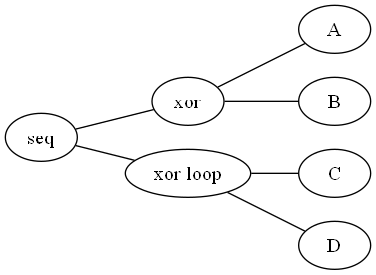
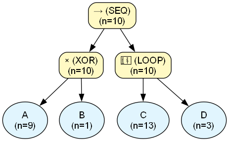
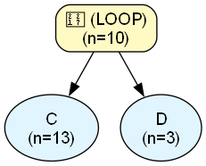

# Process Engine Audit Report

## Dataset & Audit Overview
| Metric | Value |
| :--- | :--- |
| **Dataset Name** | `test_24_zero_redo.csv` |
| **Noise Threshold** | `0.0` |
| **Fitness** | `N/A (skipped)` |
| **Precision** | `N/A (skipped)` |
| **Total Cases in Log** | `10` |
| **Unique Activities** | `4` |
| **XOR Operators** | `1` |
| **LOOP Operators** | `1` |
| **SEQ Operators** | `1` |
| **PAR Operators** | `0` |
| **Binarization Additions** | `0` |
| **Tau Operators Added** | `0` |
| **Total Found Patterns** | `9` |
| **Verified Patterns** | `7` |
| **Discrepancy Patterns** | `0` |
| **Ghost Patterns** | `0` |
| **Nested LOOPs** | `1` |
| **Nested PARs** | `0` |
| **Tree Exposure (Strict, End-to-End % of N)** | `60.00%` |
| **Tree Exposure (Strict, Fragment-Level % of N)** | `98.46%` |
| **Tree Exposure (Strict, Fragment-Level, >=2 activities, % of N)** | `60.00%` |
| **Tree Exposure (Local-Strict % of N)** | `100.00%` |
| **Tree Exposure (Local-Strict, >=2 activities, % of N)** | `60.00%` |
| **Total Forced Volume (incl. unresolved AS, % of N)** | `60.00%` |
| **AS-Resolved Volume (% of N)** | `0.00%` |
| **AS-Resolved Volume, PAR-only (% of N)** | `0.00%` |
| **AS-Resolved Volume, LOOP-only (% of N)** | `0.00%` |
| **AS-Opaque Volume (% of N)** | `0.00%` |
| **Data Exposure (Confirmed % of Claimed Volume)** | `100.00%` |
| **Data Exposure, ST-only (% confirmed)** | `100.00%` |
| **Data Exposure, ST + ST-in-PAR (% confirmed)** | `100.00%` |
| **Data Coverage, ST-only (% of real log)** | `65.38%` |
| **Data Coverage, ST + ST-in-PAR (% of real log)** | `65.38%` |
| **Data Coverage, Total (% of real log)** | `100.00%` |
| **Max Fractional Exposure (Worst-Case Normalized)** | `72.50%` |
| **Avg Fractional Exposure (Typical-Case Normalized)** | `98.46%` |
| **Mean Absolute Exposure Volume (events/case)** | `1.60` |

---

## Original PM4Py Tree




```text
->( X( 'A', 'B' ), *( 'C', 'D' ) )
```

## Assimilated Master Tree




## Trace Verification

| Type | Abstract Pattern | Variations Observed | Predicted Freq | Actual Log Freq | Audit Status |
| :--- | :--- | :--- | :--- | :--- | :--- |
| `[ST]` | `A` | Exact Token Match | $\ge$ 9 | **9** | ✅ **VERIFIED** |
| `[ST]` | `B` | Exact Token Match | $\ge$ 1 | **1** | ✅ **VERIFIED** |
| `[ST (in LOOP_1)]` | `C` | Exact Token Match | $\ge$ 13 | **13** | ✅ **VERIFIED** |
| `[ST (in LOOP_1)]` | `D` | Exact Token Match | $\ge$ 3 | **3** | ✅ **VERIFIED** |
| `[ST]` | `⟨C⟩` | Exact Token Match | $\ge$ 7 | **7** | ✅ **VERIFIED** |
| `[AS]` | `[nested LOOP_1]` | Exact Token Match | $\ge$ 1 | **10** | ✅ **VERIFIED** |
| `[ST]` | `⟨A, C⟩` | Exact Token Match | $\ge$ 6 | **7** | ✅ **VERIFIED** |

## Audit Summary
- **Perfect Pattern Verifications:** 7
- **Frequency Discrepancies:** 0
- **Ghost Patterns (Fatal):** 0
- **Skipped (Complexity > 1000):** 0
- **Tree Exposure (Strict, End-to-End % of N):** 60.00%
- **Tree Exposure (Strict, Fragment-Level % of N):** 98.46%
- **Tree Exposure (Strict, Fragment-Level, >=2 activities, % of N):** 60.00%
- **Tree Exposure (Local-Strict % of N):** 100.00% ⚠️ *includes locally-known content inside opaque PAR/LOOP blocks -- can read near 100% even when End-to-End is 0%*
- **Tree Exposure (Local-Strict, >=2 activities, % of N):** 60.00%
- **Total Forced Volume (incl. unresolved AS, % of N):** 60.00%
- **AS-Resolved Volume (% of N):** 0.00%
- **AS-Resolved Volume, PAR-only (unordered co-occurrence, % of N):** 0.00%
- **AS-Resolved Volume, LOOP-only (unknown redo count, % of N):** 0.00%
- **AS-Opaque Volume (% of N):** 0.00%
- **Data Exposure (Confirmed % of Claimed Volume):** 100.00%
- **Data Exposure, ST-only (% of claimed ST volume confirmed in log):** 100.00%
- **Data Exposure, ST + ST-in-PAR (% of claimed volume confirmed in log):** 100.00%
- **Data Coverage, ST-only (% of real log explained by VERIFIED strict patterns):** 65.38%
- **Data Coverage, ST + ST-in-PAR (% of real log explained):** 65.38%
- **Data Coverage, Total (% of real log explained by any VERIFIED pattern):** 100.00%
- **Max Fractional Exposure (Worst-Case Normalized):** 72.50% (expected length: 8.00 events)
- **Avg Fractional Exposure (Typical-Case Normalized):** 98.46% (expected length: 2.60 events)
- **Mean Absolute Exposure Volume:** 1.60 events/case

---

## Nested Structures Reference
The following complex blocks were abstracted during the audit to prevent combinatorial explosion:\n
### `[nested LOOP_1]`
- **Internal Structure:** `(C ∗ D)`
- **Block Frequency:** 10

- **Max Loop Iterations:** `3`
- **Max Sub-Sequence Length:** `7` steps (if one case consumes all iterations)


